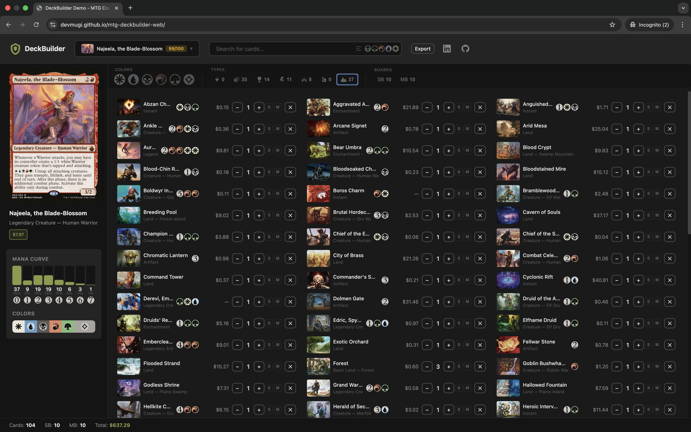
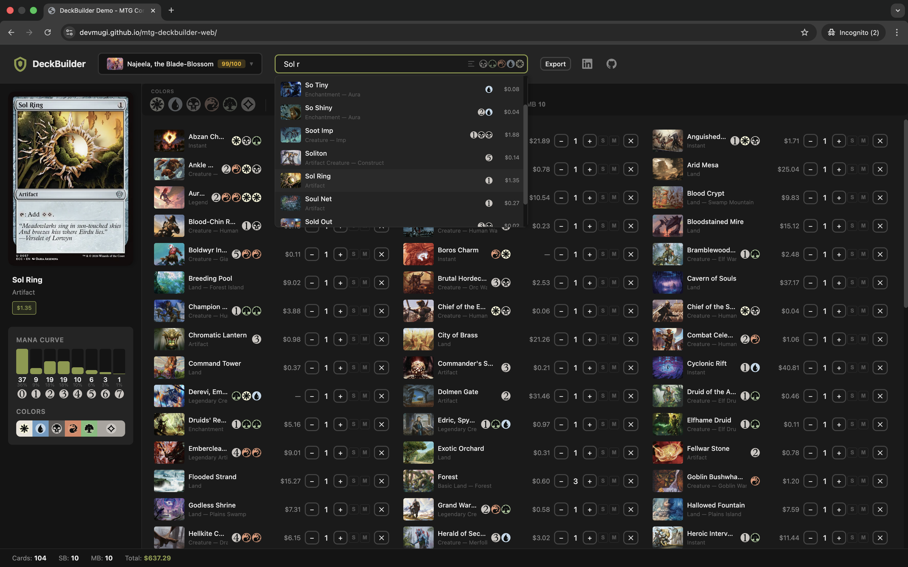
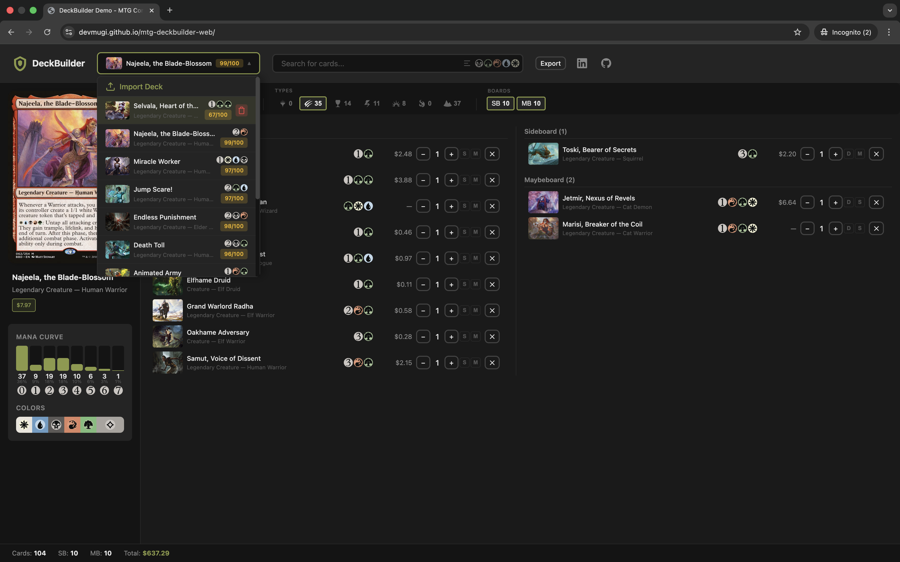
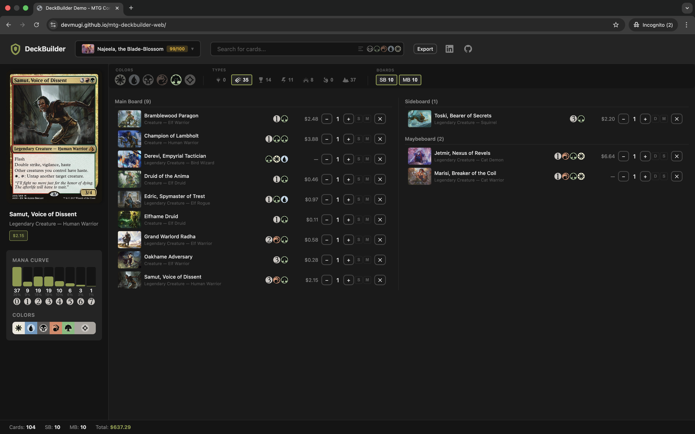
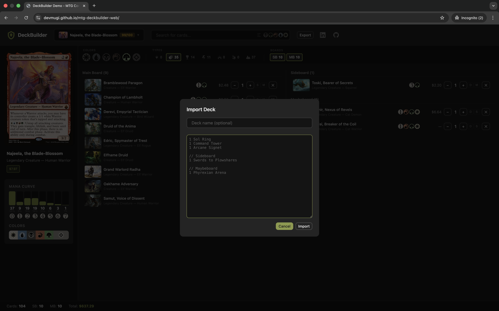
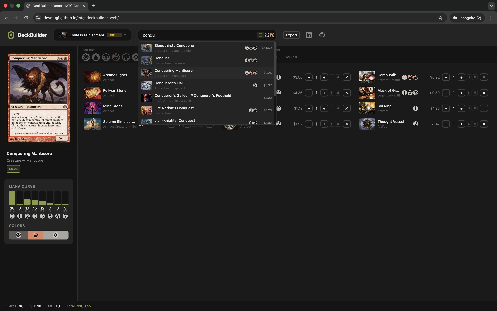
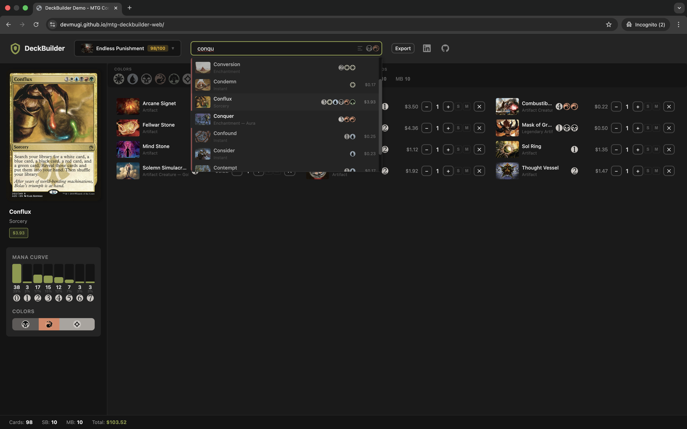

# MTG Commander Deck Builder

A fast, client-side deck building tool for Magic: The Gathering Commander format, powered by the Scryfall API.



**[Live Demo](https://devmugi.github.io/mtg-deckbuilder-web)**

## Features

- **Smart Card Search** — Autocomplete with card art, mana cost, type, and price preview
- **Color Identity Filtering** — Automatically filters cards to match your commander's colors
- **Multi-Zone Support** — Manage main deck, sideboard, and maybeboard separately
- **Deck Statistics** — Mana curve, color distribution, and card type breakdown
- **Import/Export** — Paste deck lists with full undo support
- **Preconstructed Decks** — Load popular Commander decks instantly
- **Offline Persistence** — Decks auto-save to localStorage

### Screenshots

<p align="center">
  
  
</p>
<p align="center">
  
  
</p>
<p align="center">
  
  
</p>

## Why Vanilla JavaScript?

Web development isn't my primary skill — but with [Claude Code](https://claude.ai/code), building for the web became accessible. This project deliberately avoids frameworks to focus on fundamentals:

| Decision | Rationale |
|----------|-----------|
| **No React/Vue/Svelte** | Learn the DOM directly, not abstractions over it |
| **No build tools** | Zero config, instant dev server, ships exactly what's written |
| **ES6 modules** | Native browser module system — no bundler required |
| **CSS custom properties** | Theming without Sass/PostCSS complexity |

### What I Gained

- **Deep DOM understanding** — Event delegation, efficient re-renders, state management without a virtual DOM
- **API design skills** — Built a pub/sub event system and rate-limited API client from scratch
- **AI-assisted development** — Learned to effectively collaborate with AI tools to accelerate learning in unfamiliar domains

> Building this proved that domain expertise + AI tooling can produce production-quality results outside your primary stack.

## Architecture

```
┌─────────────────────────────────────────────────────────────┐
│                        index.html                           │
│                      (entry point)                          │
└─────────────────────────────┬───────────────────────────────┘
                              │
                              ▼
┌─────────────────────────────────────────────────────────────┐
│                         app.js                              │
│              (orchestration & event handling)               │
└───────┬─────────────┬─────────────┬─────────────┬───────────┘
        │             │             │             │
        ▼             ▼             ▼             ▼
   ┌─────────┐  ┌──────────┐  ┌──────────┐  ┌───────────┐
   │ deck.js │  │ search.js│  │ render.js│  │ precons.js│
   │ (state) │  │  (UI)    │  │  (DOM)   │  │  (data)   │
   └────┬────┘  └────┬─────┘  └──────────┘  └───────────┘
        │            │
        ▼            ▼
   ┌─────────┐  ┌───────────┐
   │storage.js│ │scryfall.js│
   │(persist) │ │  (API)    │
   └──────────┘ └───────────┘
```

### Key Patterns

- **Event-driven state** — Pub/sub pattern in `deck.js`; UI subscribes to state changes
- **Rate-limited API** — 75ms minimum between Scryfall calls to respect their limits
- **In-memory cache** — Card data cached to avoid duplicate fetches
- **CSS tokens** — Design system via custom properties in `tokens.css`

## Getting Started

No build step required — this is a static site.

```bash
# Clone the repo
git clone https://github.com/devmugi/mtg-deckbuilder-web.git
cd mtg-deckbuilder-web

# Serve locally (pick one)
python3 -m http.server 8000
# or
npx http-server
# or use VS Code Live Server extension
```

Then open [http://localhost:8000](http://localhost:8000)

### Quick Tour

1. **Select a precon** from the dropdown to load a deck instantly
2. **Search for cards** — type a card name, use ↑↓ to navigate, Enter to add
3. **Toggle zones** — switch between Main Deck, Sideboard, and Maybeboard
4. **Import a deck** — paste a deck list from any source

## Tech Stack

| Category | Technology |
|----------|------------|
| Language | JavaScript (ES6+ modules) |
| Styling | CSS3 with custom properties |
| API | [Scryfall API](https://scryfall.com/docs/api) |
| Icons | [Mana Font](https://mana.andrewgioia.com/) |
| Hosting | GitHub Pages |

## License

MIT — feel free to fork and build your own deck builder.

---

<p align="center">
  Built by <a href="https://github.com/devmugi">devmugi</a> ·
  <a href="https://www.linkedin.com/in/denyshoncharenko/">LinkedIn</a>
</p>
